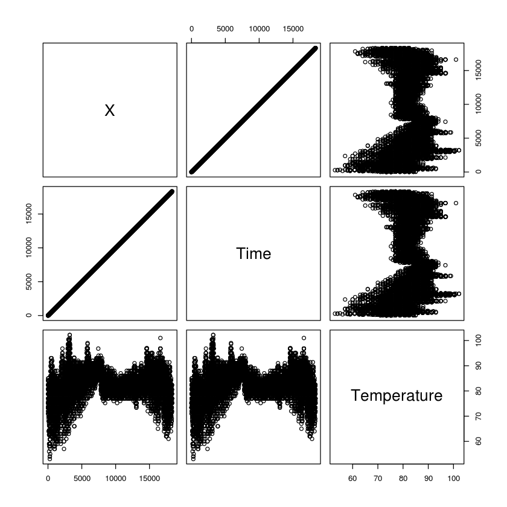

# datascience-R

Repo này ghi chép lại cách mà một Data Engineer / Data Science xử lý dữ liệu với R. Mình tự học, đang làm việc về ngành khoa học dữ liệu. Sau `Python` thì mình bắt đầu với R, là một ngôn ngữ khá mạnh để xử lý dữ liệu.

Mỗi chương / phần lớn sẽ được đặt trong 1 thư mục cùng với Notebook cụ thể, cập nhật thường xuyên theo những gì mà mình học được. Một số bài viết hoàn chỉnh mà mình đúc kết được cũng có thể được đăng ở https://blog.duyetdev.com 


# 0. Getting started

1. Cài đặt [R](https://www.r-project.org/), [RStudio](https://www.rstudio.com/products/rstudio/download/).
2. [Cài đặt R trên Jupiter Notebook (Ubuntu 14.04 / 14.10 / 16.04)](http://blog.duyetdev.com/2016/11/r-tren-jupiter-notebook-ubuntu-1404.html).

## 1. [Import  data](1-import-data/import-data.ipynb)

`utils` package (mặc định)

1. `read.csv()` - Đọc data.frame từ csv
2. `stringsAsFactors = TRUE`
3. `read.delim() & read.table()` - Đọc data.frame từ bất kỳ dạng file tabular nào.
4. `summary()` - Thống kê miêu tả nhanh về data.frame
5. `file.path()` - Tạo đường dẫn đến data.
6. Lọc dữ liệu với `which.min` và `which.max`
7. Sử dụng `colClasses` để ignore một số cột khi import data.

[Sử dụng package `readr`](1-import-data/readr-package.ipynb), thư viện này có một số hàm hay để đọc và xử lý data.frame.

* `read_csv()`
* `read_tsv()` đọc *.tsv file với tham số `col_names`
* `read_delim()`
* `skip` và `n_max` 
* `col_types = "iiiiiddd"` parse datatype.

[Xử lý Excel file với `readxl` package.](1-import-data/readxl-package.ipynb)

* `excel_sheets()` liệt kê danh sách sheets name.
* `read_excel()` import data.frame từ excel.

Tham khảo thêm: https://github.com/hadley/readxl

[Sử dụng R để kết nối tới CSDL, `DBI` package](1-import-data/DBI-package.ipynb)

* `dbConnect()` kết nối đến CSDL `RMySQL::MySQL()`
* `dbListTables()` liệt kê danh sách bảng.
* ...

Tham khảo thêm: https://cran.r-project.org/web/packages/DBI/index.html

[Import file từ URL](1-import-data/import-from-url.ipynb)

Thư viện `read.csv`, `read.tsv`, ... của `utils` hoặc `readr` có thể đọc trực tiếp file từ URL. 
```
url_csv <- "http://s3.amazonaws.com/assets.datacamp.com/production/course_1478/datasets/swimming_pools.csv"
swimming_pools <- read.csv(url_csv)
```

[Parse JSON với `jsonlite` package](1-import-data/JSON.ipynb)

* `fromJSON()` parse từ raw JSON và URL.
* `toJSON()` convert data.frame hoặc list sang **JSON** string.
* `prettify()` - format JSON dạng "đẹp đẹp" dễ  đọc :D - `minify()` ngược lại.

## 2. [Cleaning Data ](2-cleaning-data/cleaning-data.ipynb)

The data cleaning process: 
 - Preparing data for analysis
 - Exploring raw data 
 - Tidying data

 * `head()` và `tail` để xem 1 phầ n của dataframe.
 * `str(data.frame)` xem cấu trúc dataframe.
 * `dim()` chiều dữ liệu và `names(df)` xem các cột của df.
 
 Ngoài ra 1 thư viện rất hay được sử dụng là `dplyr`
 
  * `glimpse()` có chức năng tương tự `str()`
  * `summary(Mumbai2013)` summary data.
 
Visualizing data với 1 số hàm cơ bản 

* `hist()` histogram data.
    
* `plot(x, y)`
    


# How to contribute

1. Fork the project on Github
2. Create a topic branch for your changes
3. Ensure that you provide documentation and test coverage for your changes (patches won’t be accepted without)
4. Create a pull request on Github (these are also a great place to start a conversation around a patch as early as possible)

# License

MIT License

Copyright (c) 2016 Van-Duyet Le

Permission is hereby granted, free of charge, to any person obtaining a copy of this software and associated documentation files (the "Software"), to deal in the Software without restriction, including without limitation the rights to use, copy, modify, merge, publish, distribute, sublicense, and/or sell copies of the Software, and to permit persons to whom the Software is furnished to do so, subject to the following conditions:

The above copyright notice and this permission notice shall be included in all copies or substantial portions of the Software.

THE SOFTWARE IS PROVIDED "AS IS", WITHOUT WARRANTY OF ANY KIND, EXPRESS OR IMPLIED, INCLUDING BUT NOT LIMITED TO THE WARRANTIES OF MERCHANTABILITY, FITNESS FOR A PARTICULAR PURPOSE AND NONINFRINGEMENT. IN NO EVENT SHALL THE AUTHORS OR COPYRIGHT HOLDERS BE LIABLE FOR ANY CLAIM, DAMAGES OR OTHER LIABILITY, WHETHER IN AN ACTION OF CONTRACT, TORT OR OTHERWISE, ARISING FROM, OUT OF OR IN CONNECTION WITH THE SOFTWARE OR THE USE OR OTHER DEALINGS IN THE SOFTWARE.
